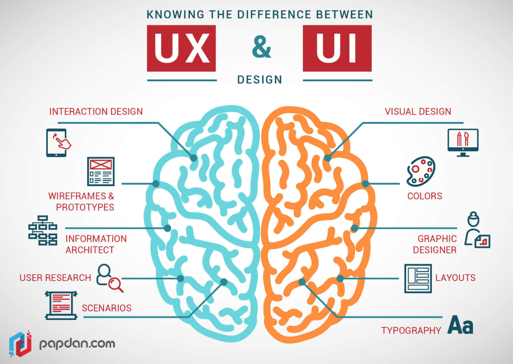
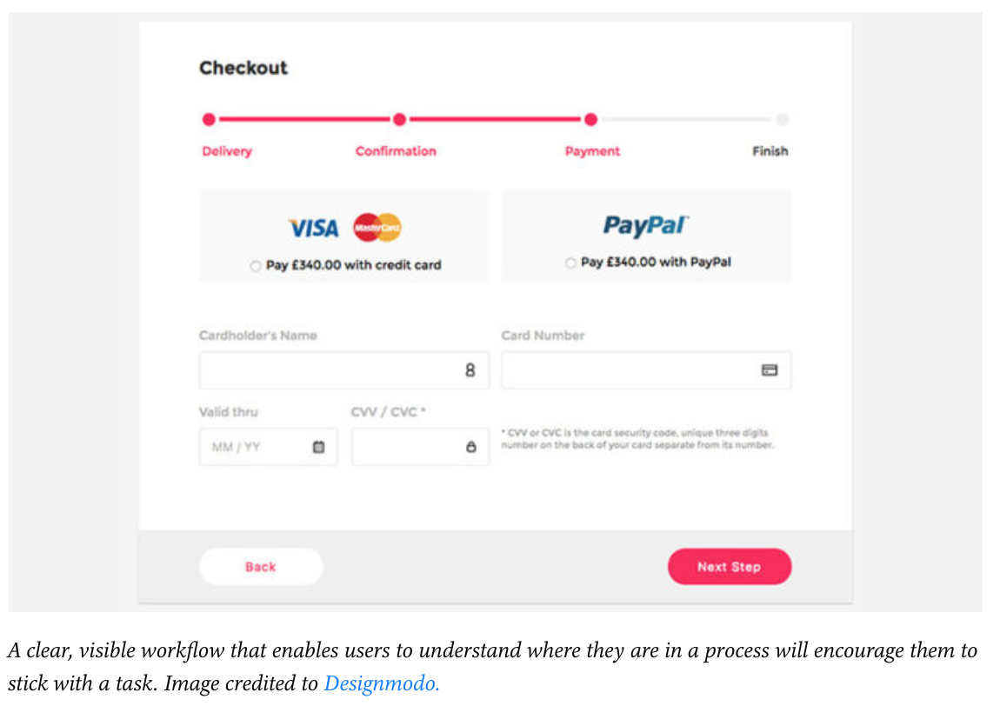
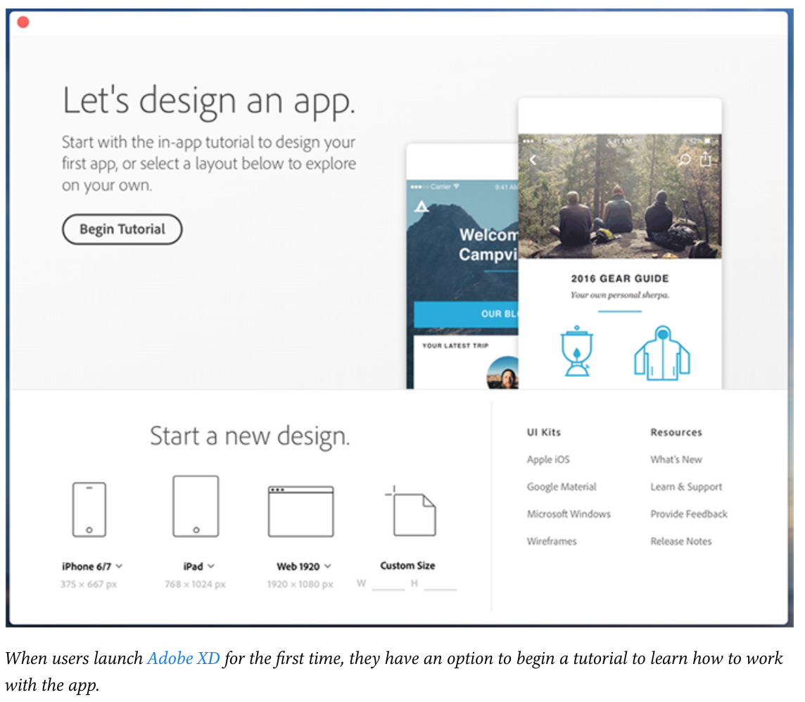
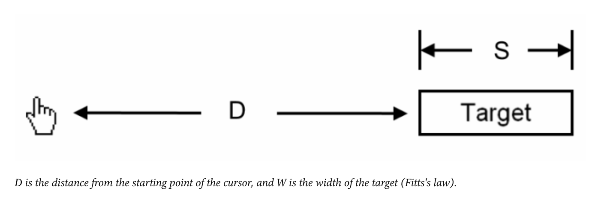
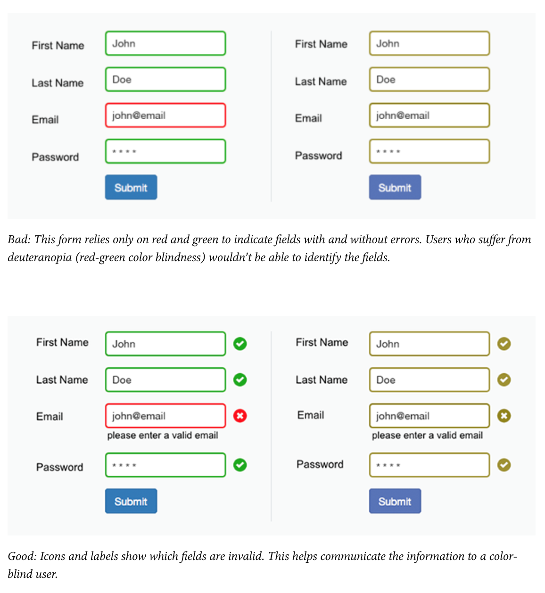
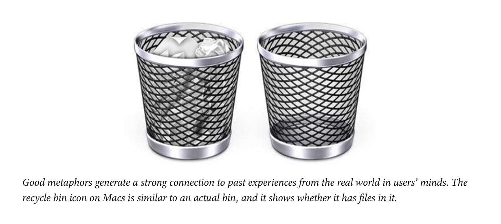
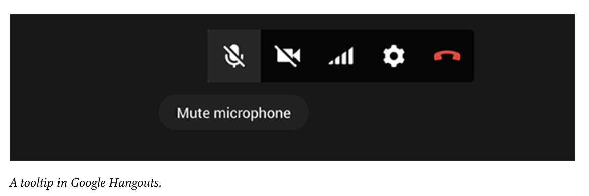
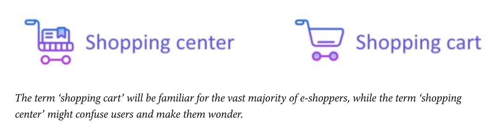
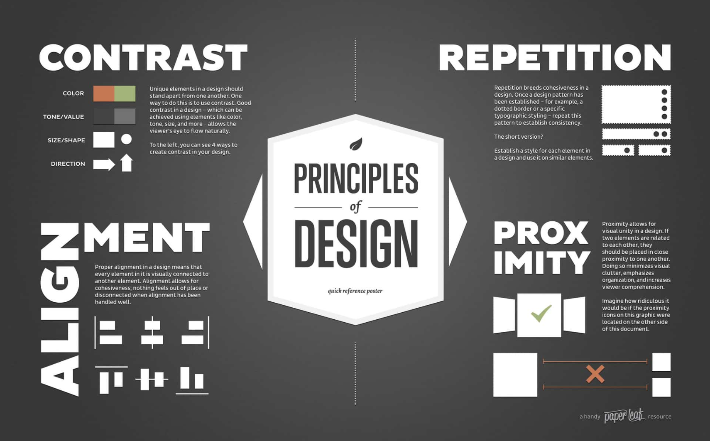

# Principles of UI Design

> "Design is the intermediary between information and understanding." -- Hans Hoffman

**User interface (UI) Design** is the process of making interfaces in software or computerized devices with a focus on looks or style. Designers aim to create designs users will find easy to use and pleasurable. 

Even though this is more focused on the look and style of the product, the user is still at the center of this design. 
When it’s done well, users don’t even notice it. When it’s done poorly, users can’t get past it to efficiently use a product.

While UX refers to how the audience will navigate through the page, and making it as easy as possible for them, UI refers to the consideration of how to put design elements together that will make the website pleasing to look at. 

In order too apply UI Design to products lets explore the fundamentals that will guide our design to be a user focused design.

## The principles are:

### **1. Place users in control of the interface**

Effective user interfaces give them a sense of control over a product. Keeping them in control makes the feel comfortable and they will learn the product faster. 

To achieve this: *Make actions reversable,* this means that should be backtrack to the orgnial page they landed on. Giving them the **Undo and Redo** lets the user to back step-by-step through changes. This action is most usefull in software like graphic design platforms, text editors, and github. 

Another good example, is GMAILS option to undo an sent email or has been trashed. 

- **Create easy-to-navigate interface** Navigation should always be clear and self-evident. Users should be able to enjoy exploring the interface of any software product. Make users comfortable by providing some context of where they are, where they’ve been, and where they can go next:

- **Provide Visual Cues:** They serve as remainders, points of reference as they move through your product. Page titles, highlights for currently selected navigation options, and other visual aids give users an immediate view of where they are in the interface. A user should never be wondering, “Where am I?” or “How did I get to this screen?”

- **Predictability.** Users should be provided with cues that help them predict the result of an action. A user should never be wondering, “What do I need to press in order to do my task?” or “What is this button for?”

- Accomdate users with different skill levels: Users of different skill levels should be able to interact with a product at different levels. Don’t sacrifice expert users for an easy-to-use interface for novice or casual users. Instead, try to design for the needs of a diverse set of users, so it doesn’t matter if your user is an expert or a newbie. Most softwares add feautres like tutorials and explanations that are helpful for novice users.

### **2. Make it comfortable to interact with a product** 

Elminate all elements that are not helpful for your users. Simplify interfaces by removing unnecessary elements or content that does not directly support user tasks. Strive to design your app in a way that all information presented on the screen will be valuable and relevant. Examine every element and ask, “Is this really needed?”

- **Avoid Jargon and system-oriented terms:** When designing a product, it’s important to use language that is easy to read and understand. The system should speak the user’s language, with words, phrases, and concepts familiar to the user, rather than jargon or system-oriented terms. 

- **Fitt's Law** means that the time to aquire a target is a functions of the distance to and the size of the target. 

- Design accessible interfaces means to make sure your product could be used by users of all abilities. Colors is one tool for accessiblity but for users that are colors blind you needs to pair it with icons so its accessible to that user group as well.

- **Use real World Metaphors:** Using metaphors in design allows users to create a connection between the real world and digital experiences. Real-world metaphors empower users by allowing them to transfer existing knowledge about how things should look and work. Metaphors are often used to make the unfamiliar familiar. For example: the trash can on apple laptops in the real world we associate them with throwing items away we no longer use so when we see it on the interface we know that is where we can dispose of old and uncesseary files 

### **3. Reduce cognitive load** 

Reduce the leanring cost of trying a new product it is better to avoid making users think.work too hard to use your product. Features such as **recognition over recall** designer promote this by providing visual aids and context sensitive details so users recognize it. 

### **4. Make user interfaces consistent**

Consistency is one of the strongest contributors to usability and learnability. The main idea of consistency is the idea of transferable knowledge — let users transfer their knowledge and skills from one part of an app’s UI to another, and from one app to another app.

- **Visual Consitency:** The same colors, fonts, and icons should be present throughout the product. Don’t change visual styles within your product for no apparent reason. For example, submit button should always be the same color on your product no matter the process stage that they are in. 

- **Functional Consistency:** Consistency of behavior means the object should work in the same way throughout the interface. The behavior of interface controls, such as buttons and menu items, should not change within a product. 1) Don't reinvent patterns: Patterns are solutions and they exist so stick with those 2) Don't try to reinvent terminiology: Avoid using new terms when there are words available that users already know.

##### These are 4 golden rules of UI design to practice. 

Now, that we have those 4 golden rules lets look at the principles of design to make sure our design looks good. 

# CARP: Visiual Design Principles 

[Let play a game. Point out the bad design in the pictures and tell me what UI or CARP is missing that could solve the design error](https://www.boredpanda.com/poor-design-decisions-fails/?utm_source=google&utm_medium=organic&utm_campaign=organic)

### Tools to Practice Design: 

[1. Pixact.ly](https://pixact.ly/)

[2.Color Method](https://color.method.ac/)

[3.Kern Type](https://type.method.ac/#)

### Design Resources: 

[1. Adobe Beginners Cheat Sheet](https://www.pgsd.org/cms/lib07/PA01916597/Centricity/Domain/202/illustrator_for_beginners_tastytuts.pdf)

[2. Adobe Color Wheel](https://color.adobe.com/create)

[3. Fonts](https://www.dafont.com/)

[4. Inspiration](https://www.pinterest.com/?autologin=true)

[5. Just google it](https://www.google.com/)
