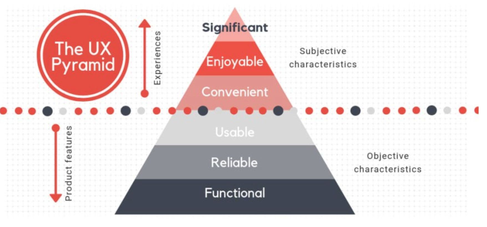
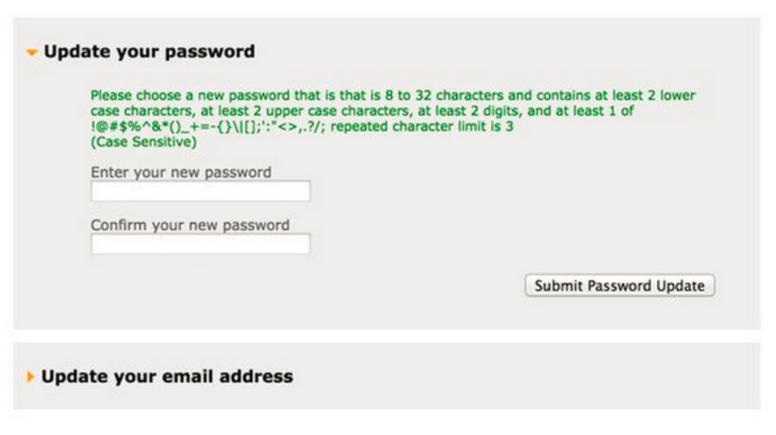

# Principles of UX Design

[What the %$@&! is UX Design](https://www.youtube.com/watch?v=Ovj4hFxko7c "What the HECK is UX Design?")

**User Experience Design (UXD)** is the process of enhancing user satisfaction by improving the usability, accessibility, and pleasure provided in the interaction between the user and a product or service. 

UX is the entire process. A collection of actvities that you do the provide digital experiences for users. That encompasses..

**A Better undestanding:** When we talk about film we meant he finished product that film watchers watch. The fiished product express dialuogue, music, acting, and scenes. Filmmaking is the process so producers create sotyrboards, casting, cinematpgrahy  etc all the activties that produce a product to satisfy a the public. 

> ### UX Design = Filmaking 

#### What should be the perfect User Experience Design?

In order to reach our goal of ulitmate users satisfaction lets look the levels we need to engage the user in an enjoable experince. Based on Maslow Heirachy of needs we have the **UX Pyramid** 

**Level 1: Functional Level**

This level is met when the product meets the requirements for the proper operation. It inculdes key features such as browser compabalitiy, responsive to all screen sizes, collects data, and button association. 

**Level 2: Relibale Level**

The product should be available on and make the design fit all devices. The accuracy depends heavily on the UI part. 

**Level 3: Usablility Level**

Users should not get lost or confused. They msut find the cotnent or products/information they need.

**Level 4: Convenient Level**

This level is met when the users use it frequently in different situations. You acheive this by eleinetate barriers that make the product difficult, users control their own expierience, and everything is clear on your website. 

**Level 5: Enoyable Level**

This level is met when users enojy the product or service so much that they share and prmote it and its part of their daily routine. 

**Level 6: Significant Level**

This level is met when the user loves it and they reflect about how much the love it. 

#### People scan, they don't read
These are the levels you aim for to capture the audience. Most of the times people scan, they don't read so you have to get your content across with minimal text. Because you know that people scan, you also want to be intentional about guiding people’s eye to the first thing, the second thing and the last thing you want someone to look at on your site. By using this strategy, you are essentially highlighting importance.

## Laws of UX 

1. **Meet the Users Needs** Find the common ground between What you think the users do and they users actually do? Graphics, layout, text, and interactive elements work in synergy to present the user with an experience, not just present them with information. Making the experience of the website memorable is more important than what the website says. Users often forget the data and salient points of content, but they will remember how it made them feel. 

2. **Consistency is KEY** Create a product to ahve some simlairies t other products that users use in there day to day. If it somewhat famlair useing a your new product wont come at a learning cost. the more familiar your design is to others, the faster users can learn to use it, which enhances their experience.

3. **Less is More** The less-is-more approach emphasizes simplicity as opposed to clutter or over-decoration in design. This is also means to use simple lanugage it is easy to understand, which enhances your design’s user-friendliness.

4. **Text & Visiual Hieracrhy** When putting the most important elements on the interface, highlight them so that users focus on them. In design, there are a lot of ways in which to highlight things, but the most effective is to make it larger than anything else on the screen.

5. **Don't Make Me Think!** My understanding is to use the most simple way to help users achieve their goals in the shortest time. 

### Lets find some examples.

## Activty

We are going to pair up and work togtehr to fuy understand our user. Pull out a user from the bin and you are going to have to figure out:

**WHY:** Motives and reasons they are on the UCSC quarry website

**WHAT:** What kind of features will they need to complete thier task? Think about functionality and features

**HOW:** How would the user like, prefer, that feature, functionlity to be presented?

## **U**ser e**X**pereince is the key

To really acheive a successful UX design for a product it is important to know who our user is. Let's get to know our user.

You are the users for the NEST Studios so we are going to create a USER role play activity: 

Pair Up with a memeber, one of you will be a user and other wil be a UX designer trying to find out information about the user.  

1. **User One:** *Random Youth from the community Age: 17* You are the type of user that stumbles on the website because you are aintersted in art, music, and film. You don't really know why you are there but you found it intersting. 

2. **User Two:** *Youth that is involved in DAT and wants to see past projects.* You are the type of user that that knows exaclty why you are visiting the website, you are here t find opporuntites to get learn about film and get more involved. 

3.**User Three:** *Donor Age: 51 Worked at Disney for 16 years* This user is a donor that was directed to this website to see what kind of projects his money would fund. 

4.**User Four:** *Recruiter from the community that wants to hire a NEST memeber to be part of his drone business* This user is looking for portfolios. 

As you are role playing the user do your best to put yourself in thier shoes and figure out what you would want the website to have? 

#### Take a breath and put yourself in this users shoes. What are you looking for in this website? 

