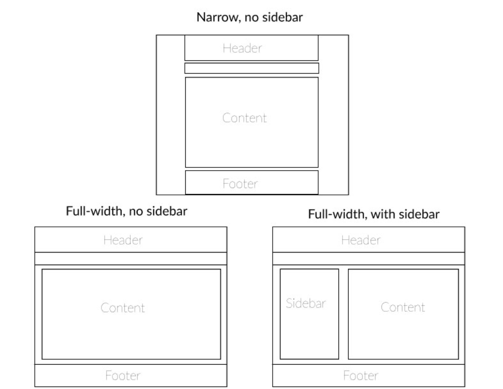
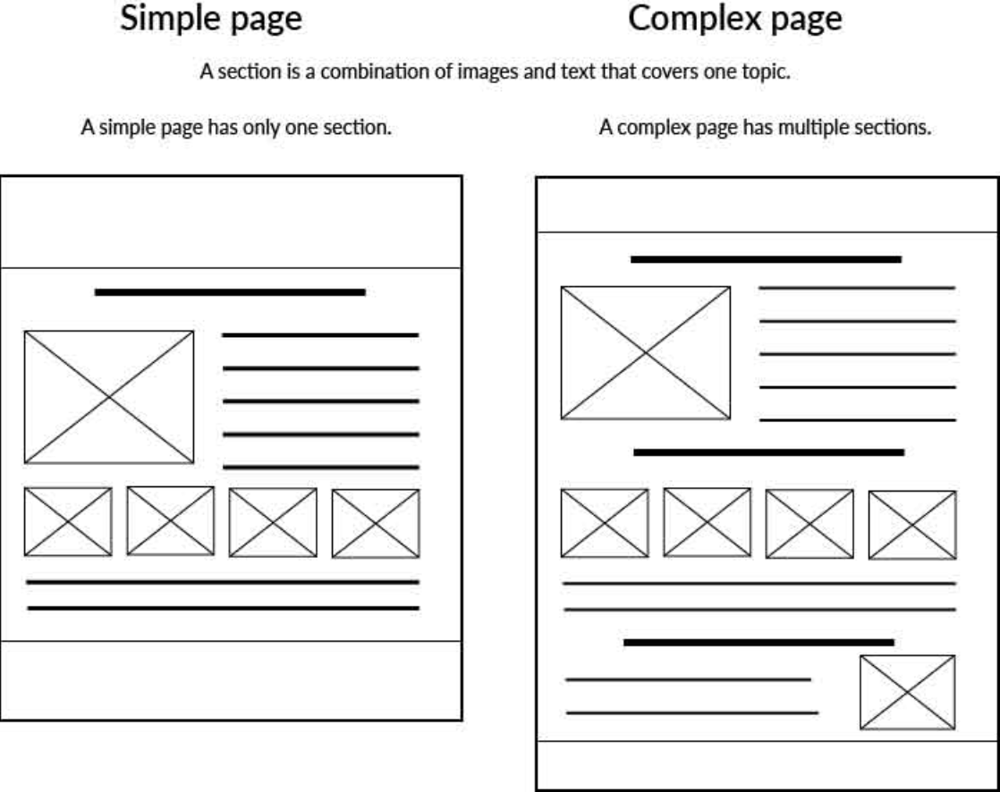
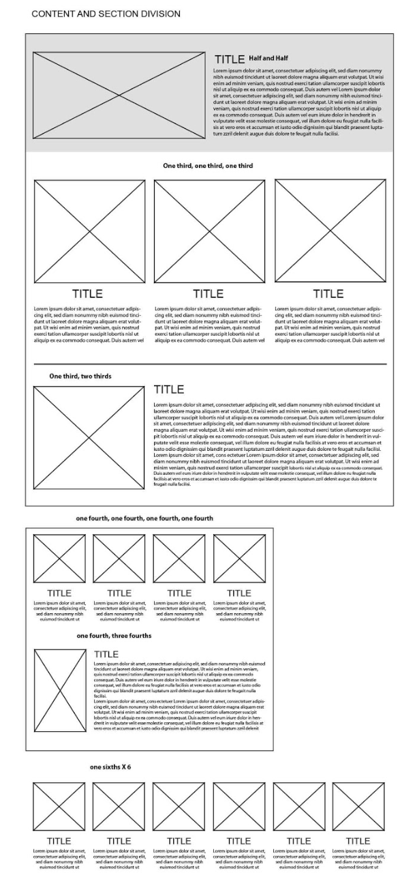
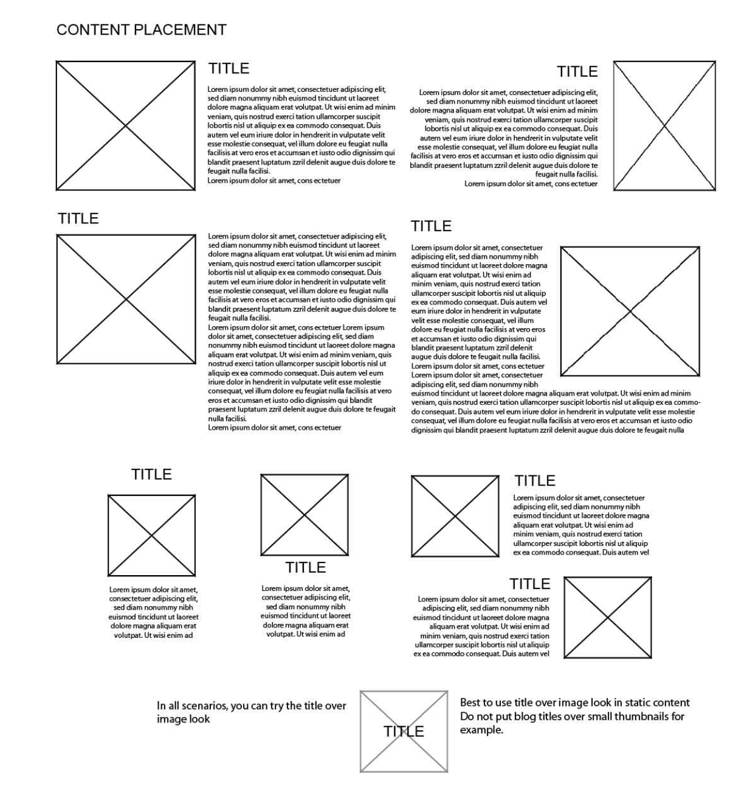

# Create a Wireframe

Wireframe Websites are composed of different parts: Header Content and Footer
It is up to you to determine if you want the the parts to meet the full width of your screen or not. 

**Let's break it down:**

### Header

1. What do you think a user friendly website should have in the header? 
2. What do you think a user friendly website should have in the content? 
3. What do you think a user friendly website should have in the footer? 

### Content

### Simple vs. Complex pages 

**Simple Page:** A simple page is a page that only has one section or topic. A section is something that divides different topics on the page.

1. What are the differences that you see here? 

### Content Layouts 

Let’s say you’ve determined what pages you want your content to go on. Now you have to think about HOW they will go on the page. 

When you think about layouts, you can think of it as the relationship between the most important elements on your page.
What are some of the most important elements on the page that direct people? 

> Titles, buttons, links, headlines, bullet points, Images, 

In the layouts you must be very intentional about where you place elements on the page. 

### Footer

The footer is the bottom part of your webiste and it ususally holds contact information and links to go back to the top parts of your website. What else do you think the footer contains? 

### Activity: Create your own wireframe. 

Create your inividual wireframes for the Homepage + About, Media (Film + Audio), Donate, Contact. Each of you will create your own indiviudual designs for it. These don't ahve to look pretty. It is about getting your visuyal idea on paper and then building up to you ideal wireframe for your website. 
