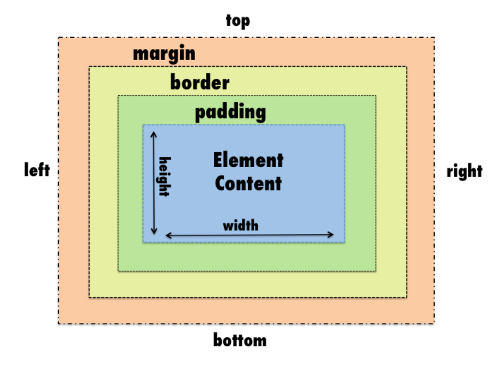

## Introduction to cascading style sheets (CSS)
At this point, you probably have a site with random colors and no layout. Your content just goes straight down the page. Don't worry, it will get better. We just put random colors to as a fast way of letting us see where the divs are. You can do so much more to make your website look decent with css (Cascading Style Sheets). 

### How do HTML and CSS work together?
Like I mentioned earlier, you already put a little bit of css in your code by putting in the atrribute style= in your html tag. 

Let's look at an example: 
```html
<h1 style="color:blue">I love Pacman</h1>
```
This is called an "inline style" or "local style" because it is placed within the HTML. Although this does the job, if you are making a big site where you need consistency, this is an extremely inefficient way of writing your styles. Imagine that I had h1 tags throughout my page and in different pages throughout my website and I wanted them all blue. I would have to copy, paste ```style="color:blue"``` after every h1 tag. If you're doing mundane tasks like that in coding, you are not doing it right. We will get more efficient as the lesson goes on because we're working our way up to coding like the pros! 

### Doing it right: Ways to organize your CSS
* Internal style sheets
We are going to start with internal style sheets just so you can see the difference. Internal style sheet means that all your style code will be between ```<style></style>``` tags inside the ```<head></head>``` tags. Like this: 

```html
<!DOCTYPE html>
<html>
   <head>
      <title>
       Pacman Tribute
      </title>
      <style>
        h1 {
          color:blue;
        }
      </style>
   </head>
   <body>
```

* External Style sheets 
Later, we will move all our styles to an external style sheet and link it to the html file. We will code like this from now on because it's cleaner. 

### How to spot/write CSS: Syntax, code structure, comments
It's helpful to know what the different parts of the css code is called because it helps with searching when you are trying to do more complex things later on. The Internet is your friend. But a lot of the times, you can't find what you need because you don't know how to search. 

```css
h1 /*Selector*/ {
  /*Your styles go inside of the curly braces*/
 color: blue; /*property:value;*/
}
```
One the code above, we are doing a lot of different things. We have our code for the h1 tage styles and we wrote the different parts of the css code in comments. We mentioned comments in html. There are comments for every language and they all serve the same purpose. In css, you have to open comments with /* and close them with */. 

<b>Parts of css</b> 
1. Selector- The selector is the part that tells the css what to style. This selector is selecting the element h1 in the html to style. The selector must be written into the html in order for this to work. 
2. { - Open curly brace, this is the start of the style code. 
3. Property- This is how you want the selector to change. A property can be color, font, rotation, border, etc. It's any design element you want to add to your selector. 
4. : - Colon, this comes after the property. 
5. Value - This is the specifics about how you want the property to change. This can be in the form of font names, color names, and numbers. 
6. ; - Semi-colon, goes at the end of every property:value pair. 
7. } - Closing curly brace, end of style code for the selector. 

```
selector {
 property:value;
 property:value;
}
```
This is the basic structure and syntax of css. Somewhere along the way, we will run into new little things like how to reference specific types of selectors and making variables- for now this is it. 

### Demo: Check if styles are working 
Delete the style attribute from your h1 tag so that your code looks like this: 
```<h1>I love Pacman</h1>```
Because of your internal style sheet, it will still be blue! Now, put a different title with an h1 tag on your site. All h1 tags will now be blue! 

## Putting your style on external sheet
Now that you know how CSS works, we will move our styles from the html to an external sheet. It will do the same thing, we will just be referring to it from a different place. Why do we do this, you ask? Your css will soon turn into a monster with many many lines of code. And because it's just nice to look at when it's formatted all spaced out, it will be a long document. We do it for readability. It's super helpful to organize things in a way we can read them and not feel overhwhelmed when we look at it. 

1. Take the code inside the ```<style></style>``` tags- this one: 
```css
  h1 {
   color:blue;
  }
```
Cut it- Command OR CTRL + X

2. Then put it in a New File on your text editor. 
3. Put the file inside the same folder where you have all your other website files. 
4. Save the file and name it style.css - that is the conventional name for your website styles. 

If you save your file and refresh your page, you will notice that your headers will not have the styles applied anymore. That is because, you are not done yet! 

### Link to your sheet in HTML
We need to tell your html file to reference the css sheet for its styles. 

1. Go to the ```<head></head>``` tag. - remember, this is where you  information your html file needs but will not be visible on your page. 
2. Make a link reference tag and put the relative path of your new css file in there. This is telling your html to reference style from an external sheet. 

```html
<link rel="stylesheet" href="style.css" >
```

Since your css file is in the root folder, do not have to put the absolute path. 

Ok now save your file, refresh your page again and boom! You have your style. You only have to do this once. Now you are good to go! 

### Classes, IDs, Elements
We are going to do more exciting stuff than just changing the color of some text. You probably noticed that your divs still have attributes in the html to change the background color. We want to move this to the css file. You probably guessed that to change the background of your div, you have to write css that looks something like this: 

```css
div {
   background-color: yellow; 
}
```

1. Write that into your css. 
2. Delete all attributes ```style=""``` from all your divs
3. Save your file 
4. Refresh
 
 **Classes**
Now, you probably noticed that ALL your divs changed to yellow. That's because the selector is calling on all divn elements. In order to set different colors for different divs, you have to add a class. A class is a name you give to a div that allows you to make a selector with different properties in css. 

Let's make a content div with a yellow, blue and pink background. 

In html, you would add ```class="box--yellow"``` to one div, 
```class="box--blue"``` to another div, and 
```class="box--pink"``` to another div. 

One div would look like this, with some content in between: 
```html
<div class="box--blue">With all you content in between</div>
```
In order to write class selectors in css, you have to start them with a [.] before the name of the class.  
```css
.box--blue {
   background-color: blue;
}
```
**_Demo:_** Do the same things to make divs with a yellow and pink background. 

One important thing for beginners to note is that the name of the selector does not do anything. You can name one of your selectors elephant and it would not change anything. Try it and refresh. 

What is actually adding the color is what is inside the brackets. However, we want to get used to naming things in ways that are helpful and decriptive. We will go over a popular naming convention we are using later on. 

You can add a new background to any div with a class. 

**_Demo:_** Change the pink background div by naming it ```class="box--blue"```. 

With classes, you can put them multiple places in your code to carry over all the properties. 

**IDs**
IDs serve a similar function as classes, but they are used slightly differently. Classes are allowed to be in multiple places in your html, but IDs should be unique and should only be placed in one div at a time. 

One cool function of an ID is that you can call on the specific element in a URL by putting a hash at the end of the URL and then the name of the ID. Let's try it. 

We're going to create an ID div for the Google Doodle. Make sure you take it out of the div it was in and make a new one for it. 

HTML: 
```html
<div id="google-doodle">
  
</div>
```

CSS: 
```css
#google-doodle{
  background-color: green;
  text-align: center; /*This makes the doodle or any content go to the center (horizontally)*/
}
```
**_Demo:_** Add #google-doodle to the end of the URL of your web page. 

IDs are not only good for skipping to specific content, but they are also helpful when writing Javascript. getElementById is a method in Javascript that allows you to add functionality to a specific thing on the page. 

### Color on the Web
We've been writing color with words, but you can get more specific by going on any color wheel and getting the hex code. A hex code is a 6 digit number that represents a color on the color wheel spectrum. 

**_Demo:_** Go to the [Adobe Color Wheel](https://color.adobe.com/create) to get some colors. Or, you can get your colors from illustrator. Replace all the colors written in words with hex codes you want. 

### Working with images
You can add a background with images inside a div. This works well when you want to add patterns or just a background image in the place of a solid color. 

We will start by putting an image as the background and have it fill the entirety of the div. 

We will make the div with the ID of "google-doodle" have the doodle as the background. 

Let's start with the css. It will look like this: 
```css
#google-doodle{
  width: 100%;
  height: 500px;
  background-image: url("images/pacman-google-doodle.png");
  background-size: cover;
  background-repeat: no-repeat;
  background-attachment: fixed;
}
```
**Explanation of code:** 
1. Setting the width to 100% makes it so that it takes up that much of the page, no matter what size the screen is. 
2. We set the height to a more specific unit: px. This means that the div will take 500px no matter what the size of the screen is. The space will look larger in height on a phone. 
3. You will put the doodle poll inside of background-image- this makes the doodle poll the background of the div. 
4. cover makes it so that the image covers the entirety of the div, but keeps it's proportions. 
5. background-repeat- we will see what this does later. Right now, we will set it to no-repeat. 
6. We will set the background attachment (relative to the page) as fixed. This creates a paralax effect when you scroll down the page. 
7. Refresh the page and see how it looks! 

**Background shorthand**
We are able to reduce to amount of lines we write by combining properties into one. We can do this in a lot of instances and there is always an order to follow in order for the shorthand to work. 

Let's reduce the top background code into just two lines. 

```css
  background: url("images/pacman-google-doodle.png") no-repeat fixed;
  background-size: cover;
```
Background size needs it's own line. Everything else can do in one line and it has to be in that order for it to work. 
background: image repeat attachment

**_Demo_**: Change the attachment to scroll and see what difference it makes. 

**_Challenge_**: 
Use the small pacman picture on the page to make a pattern on another div. hint: You will be using the repeat property in a different way. 

### CSS pseudoclasses

A pseudo-class is used to define a special state of an element.

For example, it can be used to:

Style an element when a user mouses over it
Style visited and unvisited links differently
Style an element when it gets focus

##### The syntax: 

```
selector:pseudo-class {
  property:value;
}
```

### Text and link color

## CSS box model

All HTML elements can be considered as boxes. In CSS, the term "box model" is used when talking about design and layout.

The CSS box model is essentially a box that wraps around every HTML element. It consists of: margins, borders, padding, and the actual content. The image below illustrates the box model:



## More CSS formatting
Animation 
Borders
Radius 
box shadow

## CSS Basic Layout properties

We will not be sticking with these layout properties in the project site, but it's good to know those options exist.
Ok, you've built a great first page! Good job! First pages always have random colors and wacky things on it. Say goodbye to this page because you'll probably never build anything like this again. It was a great learning experience. Take your beautiful mockup and get ready to create a beautiful, professionally-coded live version. 
